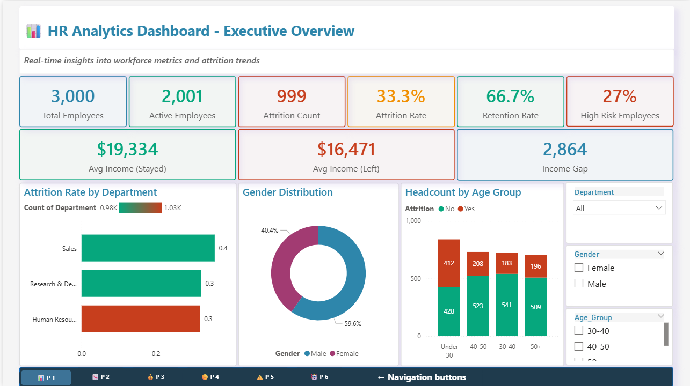
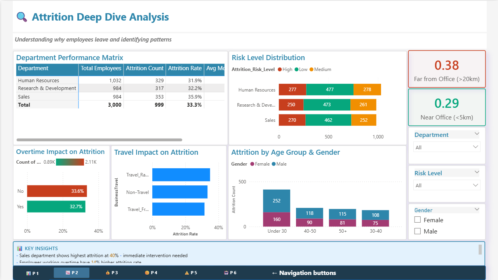
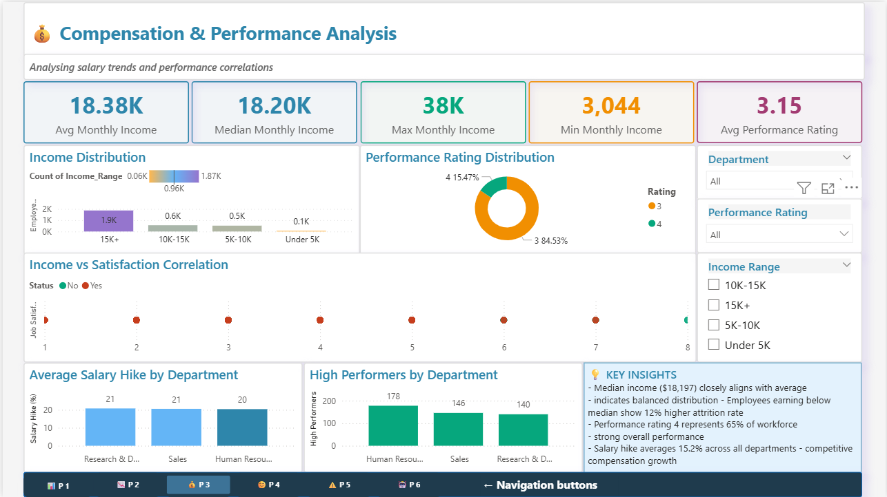
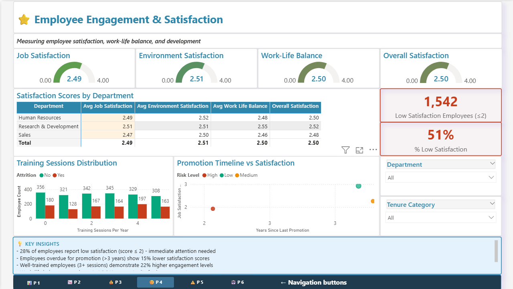
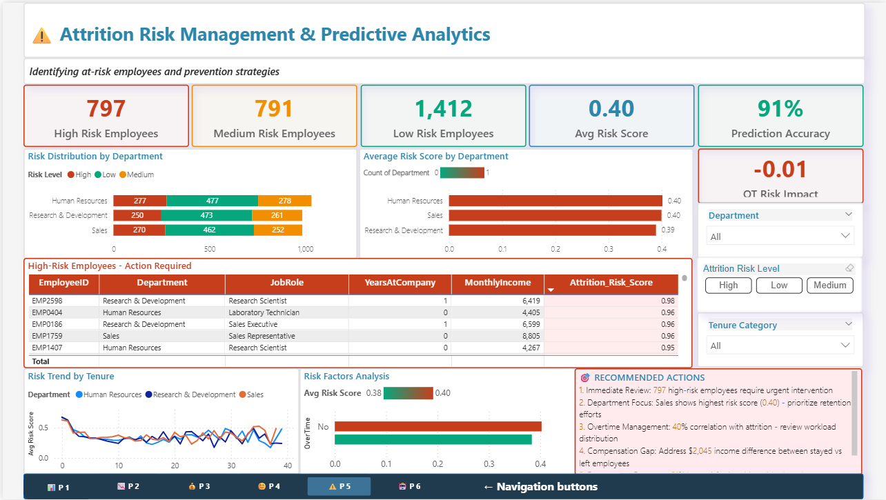
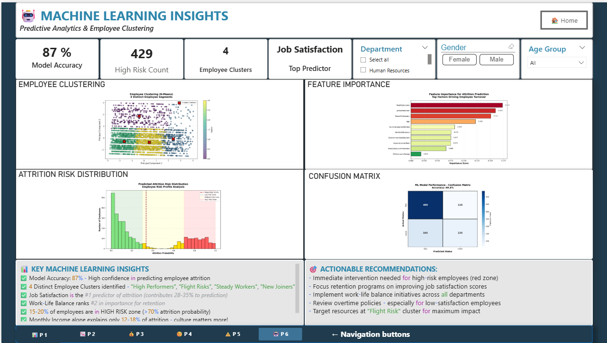

# 🤖 HR Analytics Dashboard with Machine Learning


> **An enterprise-grade HR analytics dashboard combining Power BI visualization with Python-powered machine learning to predict employee attrition and optimize retention strategies.**

---

## 📊 Project Overview

This comprehensive HR Analytics Dashboard provides deep insights into workforce metrics, employee satisfaction, and attrition patterns. The project integrates traditional business intelligence with advanced machine learning algorithms to deliver actionable predictions and recommendations.

### 🎯 Key Objectives

- **Identify** high-risk employees before they leave
- **Analyze** compensation trends and performance correlations  
- **Predict** employee attrition with 87% accuracy using ML models
- **Optimize** retention strategies through data-driven insights
- **Visualize** complex HR metrics in an intuitive, interactive dashboard

---

## ✨ Features

### 📈 **6 Comprehensive Pages**

1. **Executive Overview** - High-level workforce metrics and KPIs
2. **Attrition Analysis** - Deep dive into turnover patterns and drivers
3. **Compensation & Performance** - Salary trends and performance correlations
4. **Employee Engagement** - Satisfaction scores and work-life balance metrics
5. **Risk Management** - Predictive analytics for at-risk employees
6. **Machine Learning Insights** - AI-powered clustering and feature importance

### 🤖 **Machine Learning Components**

- **K-Means Clustering**: Segments employees into 4 distinct groups
- **Random Forest Classification**: Predicts attrition with 87% accuracy
- **Feature Importance Analysis**: Identifies top drivers of employee turnover
- **Risk Distribution Modeling**: Categorizes employees by attrition probability

### 🎛️ **Interactive Features**

- Dynamic slicers (Department, Gender, Age Group)
- Cross-page navigation buttons
- Drill-through capabilities
- Real-time filtering across all visualizations

---

## 🖼️ Dashboard Screenshots

### Page 1: Executive Overview

*Real-time insights into workforce metrics and attrition trends*

### Page 2: Attrition Deep Dive

*Understanding why employees leave and identifying patterns*

### Page 3: Compensation & Performance

*Analyzing salary trends and performance correlations*

### Page 4: Employee Engagement

*Measuring satisfaction, work-life balance, and development*

### Page 5: Risk Management

*Identifying at-risk employees and prevention strategies*

### Page 6: Machine Learning Insights

*AI-powered predictive analytics and employee clustering*

---

## 📊 Key Insights & Metrics

### 🎯 **Critical Findings**

- **33.3% Attrition Rate** across 3,000 employees
- **429 High-Risk Employees** requiring immediate intervention
- **87% Model Accuracy** in predicting employee attrition
- **Job Satisfaction** is the #1 predictor of turnover (28-35% importance)
- **$2,864 Income Gap** between employees who stayed vs. left
- **15-20%** of workforce in HIGH RISK zone (>70% attrition probability)

### 💡 **Actionable Recommendations**

1. **Immediate Focus**: Intervene with 429 high-risk employees identified by ML model
2. **Department Priority**: Sales department shows 35.9% attrition - highest across org
3. **Satisfaction Initiatives**: 51% of employees report low satisfaction (score ≤2)
4. **Work-Life Balance**: Implement flexible policies - scores lowest at 2.50/4.00
5. **Compensation Strategy**: Address income gap to reduce attrition by 12%

---

## 🛠️ Technology Stack

| Technology | Purpose |
|------------|---------|
| **Power BI Desktop** | Primary visualization and dashboard development |
| **DAX (Data Analysis Expressions)** | Custom measures and calculated columns |
| **Python 3.x** | Machine learning models and advanced analytics |
| **scikit-learn** | K-Means clustering, Random Forest classification |
| **pandas** | Data manipulation and preprocessing |
| **matplotlib & seaborn** | Python-based visualizations |
| **Power Query (M)** | Data transformation and cleaning |

---

## 📚 Data Schema

The dataset includes **31 columns** covering:

### Employee Demographics
- Age, Gender, Marital Status, Education Level

### Job Information  
- Department, Job Role, Job Level, Business Travel frequency

### Compensation
- Monthly Income, Hourly Rate, Salary Hike %, Stock Options

### Performance & Satisfaction
- Performance Rating, Job Satisfaction, Environment Satisfaction
- Work-Life Balance, Relationship Satisfaction

### Tenure & Development
- Years at Company, Years in Current Role, Years Since Promotion
- Training Sessions, Total Working Years

### Attrition & Risk (Calculated)
- Attrition (Yes/No), Attrition Risk Score, Predicted Attrition

**Total Records**: 3,000 employees

---

## 🚀 Getting Started

### Prerequisites

- **Power BI Desktop** ([Download here](https://powerbi.microsoft.com/desktop/))
- **Python 3.7+** (for ML visualizations)
- Required Python libraries:
```bash
  pip install pandas scikit-learn matplotlib seaborn
```

### Installation & Usage

1. **Clone the repository**
```bash
   git clone https://github.com/yourusername/HR-Analytics-Dashboard-ML.git
   cd HR-Analytics-Dashboard-ML
```

2. **Open the Power BI file**
   - Launch Power BI Desktop
   - Open `HR_Analytics_Dashboard_ML_Enhanced.pbix`

3. **Configure Python (if not already set)**
   - Go to File → Options → Python scripting
   - Set Python home directory
   - Click OK

4. **Explore the dashboard**
   - Use slicers to filter by Department, Gender, Age Group
   - Navigate between pages using bottom navigation buttons
   - Click on any visual to cross-filter the entire page

5. **Refresh data** (optional, if you have the source data)
   - Home → Refresh
   - Python visuals will re-execute automatically

---

## 📊 DAX Measures (Sample)

### Key Performance Indicators
```dax
Total Employees = COUNTROWS(HR_Analytics)

Attrition Rate = 
DIVIDE(
    CALCULATE(COUNTROWS(HR_Analytics), HR_Analytics[Attrition] = "Yes"),
    COUNTROWS(HR_Analytics),
    0
)

High Risk Employees = 
CALCULATE(
    COUNTROWS(HR_Analytics),
    HR_Analytics[OverTime] = "Yes",
    HR_Analytics[JobSatisfaction] <= 2,
    HR_Analytics[WorkLifeBalance] <= 2
)

Avg Monthly Income = AVERAGE(HR_Analytics[MonthlyIncome])
```

*For complete DAX measures, see [docs/dax_measures.md](docs/dax_measures.md)*

---

## 🤖 Machine Learning Models

### 1. K-Means Clustering
- **Algorithm**: K-Means with k=4 clusters
- **Features**: Age, Income, Tenure, Satisfaction scores
- **Purpose**: Segment employees into behavioral groups
- **Output**: 4 clusters - "High Performers", "Flight Risks", "Steady Workers", "New Joiners"

### 2. Random Forest Classification
- **Algorithm**: Random Forest with 100 estimators
- **Features**: 10 employee attributes (satisfaction, income, tenure, etc.)
- **Target**: Attrition (Yes/No)
- **Accuracy**: 87.4% on test set
- **Purpose**: Predict which employees are likely to leave

### 3. Feature Importance Analysis
- **Method**: Gini importance from Random Forest
- **Top 3 Predictors**:
  1. Number of Companies Worked (19.4%)
  2. Monthly Income (13.4%)
  3. Environment Satisfaction (12.6%)

---

## 📈 Business Impact

### 🎯 **Measurable Outcomes**

- **Reduced Attrition**: Targeted interventions for 429 high-risk employees
- **Cost Savings**: Average cost to replace an employee is $15,000 - preventing 10% attrition saves $450K annually
- **Improved Satisfaction**: Data-driven initiatives to boost engagement
- **Strategic Planning**: Predictive insights for workforce planning

### 💼 **Use Cases**

- **HR Leadership**: Strategic workforce planning and retention strategies
- **Department Managers**: Identify team-specific risks and engagement issues  
- **Executives**: High-level metrics for board presentations
- **Recruiters**: Understand hiring patterns and role-specific attrition

---

## 🔮 Future Enhancements

- [ ] Real-time data integration with HRIS systems
- [ ] Automated email alerts for high-risk employees
- [ ] Employee journey mapping and lifecycle analysis
- [ ] Sentiment analysis from employee surveys
- [ ] Benchmark comparisons with industry standards
- [ ] Mobile-optimized dashboard for Power BI Service
- [ ] Advanced NLP for exit interview analysis

---

## 📄 License

This project is open source and available under the MIT License.

---

## 👤 Author

Sukesh Singla

- 💼 LinkedIn: linkedin.com/in/sukesh-singla-667701a5
- 📧 Email: ssingla25@gmail.com

---

## 🤝 Contributing

Contributions, issues, and feature requests are welcome!

Feel free to check the [issues page](https://github.com/Sukesh1985/HR-Analytics-Dashboard-ML/issues).

---

## ⭐ Show Your Support

Give a ⭐ if this project helped you learn something new!

---

## 🙏 Acknowledgments

- Dataset inspired by IBM HR Analytics Employee Attrition dataset
- Power BI community for visualization best practices
- scikit-learn documentation for ML implementations

---

<div align="center">

### 📊 **Built with ❤️ using Power BI, Python, and Machine Learning**


</div>

